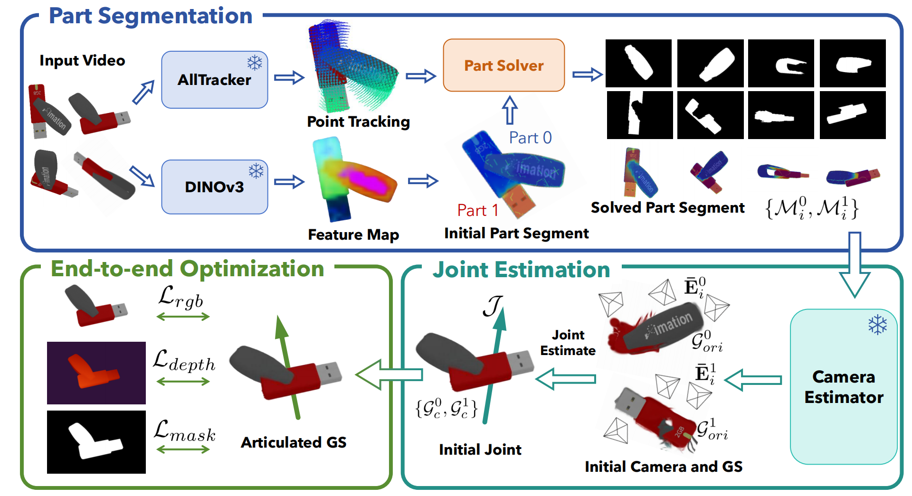

# FreeArtGS: Articulated Gaussian Splatting Under Free-moving Scenario

<div align="center">
  <p>
    <a href="https://daihangpku.github.io/">Hang Dai<sup>*</sup></a>,
    <a href="https://hwfan.io/about-me/">Hongwei Fan<sup>*</sup></a>,
    <a href="https://github.com/Zarad0X">Han Zhang<sup>*</sup></a>,
    <a href="https://github.com/Wu-dolores">Duojin Wu</a>,
    <a href="https://jiyao06.github.io/">Jiyao Zhang</a>,
    <a href="https://zsdonghao.github.io/">Hao Dong</a>
  </p>
</div>
<div align="center">
  (* indicates equal contribution)
</div>
<div align="center">
  <strong>CVPR 2026</strong>
</div>
<div align="center">
<a href="https://arxiv.org/abs/2603.22102">
  
</a>
<a href="https://freeartgs.github.io/">
  
</a>
</div>

<!-- <p align="center">
    
</p> -->

This repository contains the official implementation of [FreeArtGS: Articulated Gaussian Splatting Under Free-moving Scenario](https://freeartgs.github.io/).

<p align="center">
  
</p>


## Installation

Please follow [docs/install.md](docs/install.md) to set up the environment and required third-party dependencies.

## Data Preparation

Download FreeArt-21:

```bash
pip install gdown
gdown 1hl6s3C3919gXKvHC0ZfgrxWqFCKM3XXf -O ./
unzip ./FreeArt-21_v1.zip -d .
```

Download the MonoMobility evaluation data:

```bash
gdown 1K0z1_Gtk9G_51_o61OAhBjo1hxrDCFey -O ./
unzip ./data.zip -d .
```

## Quick Start

FreeArtGS is driven by a single YAML config. The example below runs object `100109` from FreeArt-21 with [configs/freeart-21.yaml](configs/freeart-21.yaml).

### 1. Select the Matplotlib Backend

Set `MPLBACKEND` before running the pipeline. For interactive local runs:

```bash
export MPLBACKEND=TkAgg
```

For headless/server runs:

```bash
export MPLBACKEND=Agg
```

### 2. Run the Full Pipeline

The full pipeline performs preprocessing, two-part tracking, reconstruction, blending, articulation optimization, and evaluation:

```bash
bash pipelines/freeartgs.sh --config configs/freeart-21.yaml --object_name 100109
```

Intermediate and final results will be saved under `datasets/100109/` and `outputs/100109/`.

You can also run individual stages:

```bash
bash pipelines/freeartgs.sh --config configs/freeart-21.yaml --object_name 100109 --preprocess_only
bash pipelines/freeartgs.sh --config configs/freeart-21.yaml --object_name 100109 --tracking_only
bash pipelines/freeartgs.sh --config configs/freeart-21.yaml --object_name 100109 --reconstruction_only
```

### 3. Evaluate an Existing Result

After reconstruction has finished, run:

```bash
bash pipelines/evaluate_freeartgs.sh --object_name 100109
```

### 4. Visualize Results

Visualize the two-part blend result:

```bash
python reconstruction/visualize_twopart_blend.py \
  --input-dir outputs/100109/twopart_blend \
  --motion_part 0
```

Use a hard part mask instead of the default soft blending:

```bash
python reconstruction/visualize_twopart_blend.py \
  --input-dir outputs/100109/twopart_blend \
  --motion_part 0 \
  --hard \
  --threshold 0.5
```

Visualize the final articulated Gaussian result:

```bash
python reconstruction/visualize_articulation.py \
  --input-dir outputs/100109/splatfacto-art \
  --motion_part 0 \
  --soft
```

The articulation viewer can render with GSplat and record frames periodically:

```bash
python reconstruction/visualize_articulation.py \
  --input-dir outputs/100109/splatfacto-art \
  --motion_part 0 \
  --use-gsplat-render \
  --record \
  --record-interval 0.1
```

Common controls: `A/D` step backward/forward, `R` reset, `M` toggle the moving part, `J/K` adjust the mask threshold, and `S` toggle soft/hard visualization. The articulation viewer also supports `P` to save a capture and axis/origin adjustment keys printed in the terminal.

## Open-source TODO List

- [x] Release installation instructions.
- [x] Release FreeArt-21 data.
- [x] Release the main FreeArtGS pipeline config and scripts for FreeArt-21.
- [x] Release evaluation scripts.
- [x] Release visualization tools.
- [ ] Release the pipeline config and scripts for real data.
